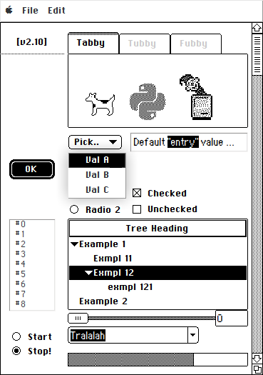
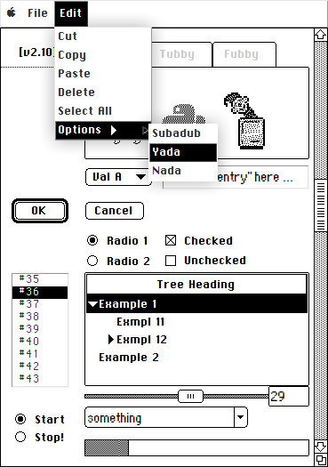
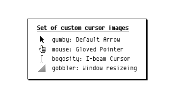

# Koollooks ttk theme

### Description
Koollooks is a Tkinter theme designed to somewhat emulate the classic Macintosh System 6 GUI, i.e. the original "Finder" desktop environment.

It is based on the venerable Clearlooks theme, which in turn builds on the Clam theme.

Included in this repository is a simple Demo app. It has no actual function other than showcasing the theme's graphical characteristics by cramming together a number of available themed widgets. See screenshots below.

On a linux system the tcl-files provided here would typically be located in ~/.local/share/tcltk.

However, the custom cursor images, having been appropriated from the legacy set of X11/tcltk recognised cursor types, is expected to be found as pixmap-files (XBM, XMC) in a dedicated directory of the system-wide cursor theme currently in use, e.g.  ~/.local/share/icons/mate-black/cursors .

The inherited license is Tcl  <https://www.tcl-lang.org/software/tcltk/license.html>

