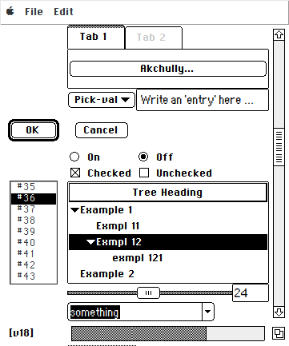

# Koollooks ttk theme

### Description
Koollooks is a Tkinter theme designed to somewhat emulate the classic Macintosh System 6 GUI, i.e. the original "Finder" desktop environment.

It is based on the venerable Clearlooks theme, which in turn builds on the Clam theme.

Included in this repository is a simple Demo app, which has no actual function other than showcasing the theme's graphical characteristics. See screenshots below.

On a linux system the tcl-files provided here would typically be located in ~/.local/share/tcltk.

The inherited license is Tcl  <https://www.tcl-lang.org/software/tcltk/license.html>

.png)
