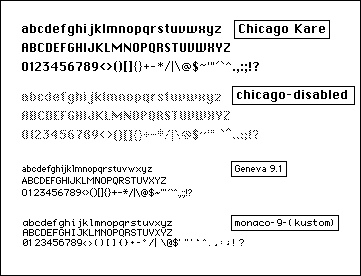

### Non-anti-aliased 1-bit "Classic Mac fonts".

1) These  *Geneva*, *Monaco* and *Chicago* look-alike fonts compliments the Koollooks Tk theme. In order to use them, they have to be installed in your normal **fonts** folder, obviously.

2) The contents of the provided **fontconfig** directory should be copied into your **~/.config/fontconfig/conf.d** directory. This will prevent anti-aliasing for the particular fonts listed there, and in some cases also applies slight hinting to achieve optimal pixelation rendering.

